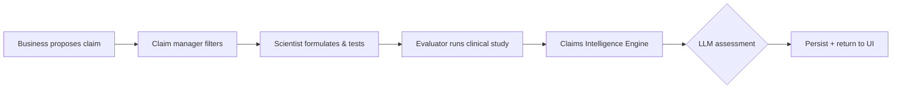

# L'Oréal Claims Intelligence Engine

Pre-interview technical assessment — a full-stack prototype that lets R&I scientists submit product claims with clinical evidence, uses an LLM to assess whether the evidence justifies the claim, persists results, and displays them in a React UI.

## Quick start

```bash
# 1. Install dependencies
cd backend && npm install
cd ../frontend && npm install

# 2. Configure environment
cp backend/.env.example backend/.env
cp frontend/.env.example frontend/.env
# Optional: set OPENAI_API_KEY in backend/.env for real LLM calls

# 3. Database
cd backend && npx prisma migrate dev

# 4. Run (two terminals)
npm run start:dev          # backend → http://localhost:3000
cd ../frontend && npm run dev   # frontend → http://localhost:5173
```

Without `OPENAI_API_KEY`, the API uses a deterministic **mock evaluator** so the demo works offline.

---

## Run & test

### Start backend

```bash
cd backend
cp .env.example .env          # first time only
npx prisma migrate dev        # first time only
npm run start:dev
```

Backend runs at: **http://localhost:3000**

### Start frontend

Open a **second terminal**:

```bash
cd frontend
cp .env.example .env          # first time only
npm run dev
```

Frontend runs at: **http://localhost:5173**

### Test frontend (UI)

1. Open **http://localhost:5173** in your browser.
2. The form is pre-filled with sample claim + clinical evidence.
3. Click **Assess claim justification**.
4. Verify the result panel shows:
   - **Justified**: Yes / No
   - **Confidence score**: percentage bar
   - **Reasoning**: LLM or mock explanation

### Test backend APIs (curl)

Base URL: `http://localhost:3000`

#### 1. Assess claim — justified example (strong evidence)

```bash
curl -X POST http://localhost:3000/api/claims/assess \
  -H "Content-Type: application/json" \
  -d '{
    "title": "Anti-wrinkle serum — 4 week study",
    "claimText": "Reduces wrinkles by 20% in 4 weeks",
    "productFormula": "Aqua, Glycerin, Retinol 0.3%, Niacinamide 5%, Hyaluronic Acid, Peptide complex",
    "scientistName": "Dr. Marie Dupont",
    "claimType": "EFFICACY",
    "evidence": "Double-blind randomized study, n=62 women aged 45-60, 4-week daily application. Primary endpoint: clinical grading of crow'\''s feet wrinkles. Results: 19.4% mean reduction vs baseline (p < 0.01). Placebo group: 3.1% (p=0.42). No serious adverse events."
  }'
```

Expected (mock mode): `justified: true`, `confidenceScore` ~0.82, `status: "APPROVED"`

#### 2. Assess claim — not justified example (weak evidence)

```bash
curl -X POST http://localhost:3000/api/claims/assess \
  -H "Content-Type: application/json" \
  -d '{
    "title": "Hydration booster — 1 week study",
    "claimText": "Increases skin hydration by 50% in 1 week",
    "productFormula": "Aqua, Glycerin 10%",
    "scientistName": "Dr. Jean Martin",
    "evidence": "Informal user feedback from 5 volunteers. No control group. No statistical analysis performed."
  }'
```

Expected (mock mode): `justified: false`, lower `confidenceScore`, `status: "REJECTED"`

#### 3. List all claims

```bash
curl http://localhost:3000/api/claims
```

#### 4. Get claim by ID

Replace `CLAIM_ID` with an `id` from the assess or list response:

```bash
curl http://localhost:3000/api/claims/CLAIM_ID
```

#### 5. Health check (root)

```bash
curl http://localhost:3000
```

### Test backend APIs (Postman / Thunder Client)

| Method | URL | Body |
|--------|-----|------|
| `POST` | `http://localhost:3000/api/claims/assess` | JSON payload (see examples above) |
| `GET`  | `http://localhost:3000/api/claims` | — |
| `GET`  | `http://localhost:3000/api/claims/:id` | — |

**POST body fields**

| Field | Required | Description |
|-------|----------|-------------|
| `title` | Yes | Study / submission title |
| `claimText` | Yes | Marketing claim to evaluate |
| `evidence` | Yes | Clinical study evidence text |
| `productFormula` | No | Ingredient list |
| `scientistName` | No | Submitting scientist |
| `scientistId` | No | Scientist identifier |
| `evaluatorId` | No | Evaluator identifier |
| `claimType` | No | `EFFICACY`, `SAFETY`, `SENSORY`, `SUSTAINABILITY`, `OTHER` |

**Sample success response**

```json
{
  "claim": {
    "id": "a265ec29-d310-4d61-a946-f068f566a468",
    "title": "Anti-wrinkle serum — 4 week study",
    "claimText": "Reduces wrinkles by 20% in 4 weeks",
    "status": "APPROVED",
    "createdAt": "2026-08-16T06:45:38.222Z"
  },
  "assessment": {
    "id": "fa0014a2-5d0c-4774-aad0-21e2974d7bdc",
    "justified": true,
    "confidenceScore": 0.82,
    "reasoning": "Evidence includes statistical significance and sample size...",
    "modelUsed": "mock-evaluator-v1"
  }
}
```

### Build for production (optional)

```bash
# Backend
cd backend && npm run build && npm run start:prod

# Frontend
cd frontend && npm run build && npm run preview
```

Preview URL after build: **http://localhost:4173**

---

## 1. Business process understanding

### End-to-end flow



| Role | Responsibility |
|------|----------------|
| **Business** | Proposes marketing claims tied to product positioning |
| **Claim manager** | Filters claims for regulatory feasibility and brand fit |
| **Scientist (R&I)** | Develops formula, runs formulation tests, submits claim + formula |
| **Evaluator** | Conducts clinical study, attaches evidence |
| **Claims Intelligence Engine** | Uses LLM to judge if evidence supports the claim, stores audit trail |

### Core scenario implemented

A Paris R&I scientist submits:
- **Claim**: e.g. *"Reduces wrinkles by 20% in 4 weeks"*
- **Product formula**: ingredient list
- **Clinical evidence**: study design, sample size, statistics, endpoints

The system:
1. Creates a `Claim` record
2. Calls OpenAI (or mock) to assess justification
3. Saves an `Assessment` with `justified`, `confidenceScore`, `reasoning`
4. Updates claim status (`APPROVED` / `REJECTED`)
5. Returns the result to the React UI

---

## 2. Research & design decisions

| Topic | Research | Decision |
|-------|----------|----------|
| **LLM evaluation** | Cosmetic claims require statistical rigor, endpoint alignment, and regulatory language | Structured JSON output with explicit evaluation criteria in system prompt |
| **Persistence** | Claims and assessments are audit artifacts | Separate `Claim` and `Assessment` tables with 1:N relationship (re-assessment over time) |
| **API design** | Single action for interview scope | `POST /api/claims/assess` creates claim + assessment atomically |
| **Offline demo** | Interviewers may not have API keys | Graceful fallback mock evaluator when `OPENAI_API_KEY` is missing |
| **Validation** | Bad inputs pollute LLM context | `class-validator` DTOs on the NestJS boundary |
| **DB for prototype** | SQLite = zero infra; PostgreSQL for production | SQLite locally; schema portable to Postgres |

### LLM prompt strategy

- **System prompt**: defines evaluator persona, criteria (stats, design, alignment, magnitude)
- **Response format**: `json_object` mode for reliable parsing
- **Temperature**: `0.2` for consistent regulatory-style judgments
- **Fallback**: mock rules check for p-values, sample size, and % alignment

---

## 3. Technical architecture

```
┌─────────────────┐     POST /api/claims/assess     ┌──────────────────┐
│  React UI       │ ──────────────────────────────► │  NestJS API      │
│  ClaimAssessment│ ◄────────────────────────────── │  ClaimsController│
│  Form           │     { justified, score, ... }   │  ClaimsService   │
└─────────────────┘                                 └────────┬─────────┘
                                                               │
                        ┌──────────────────────────────────────┼──────────┐
                        ▼                                      ▼          ▼
                 ┌─────────────┐                        ┌──────────┐  ┌────────┐
                 │  Prisma ORM │                        │  OpenAI  │  │ SQLite │
                 │  Claim +    │                        │  API     │  │  DB    │
                 │  Assessment │                        └──────────┘  └────────┘
                 └─────────────┘
```

### Stack

- **Frontend**: React 19 + Vite + TypeScript
- **Backend**: NestJS 10 + class-validator
- **Database**: Prisma 5 + SQLite (dev)
- **LLM**: OpenAI Chat Completions (`gpt-4o-mini` default)

### Key files

| Area | Path |
|------|------|
| Prisma schema | `backend/prisma/schema.prisma` |
| Assess endpoint | `backend/src/claims/claims.controller.ts` |
| LLM logic | `backend/src/claims/claims.service.ts` |
| React UI | `frontend/src/components/ClaimAssessmentForm.tsx` |

### API contract

**`POST /api/claims/assess`**

```json
{
  "title": "Anti-wrinkle serum — 4 week study",
  "claimText": "Reduces wrinkles by 20% in 4 weeks",
  "productFormula": "Aqua, Retinol 0.3%, ...",
  "evidence": "Double-blind study, n=62, p < 0.01 ...",
  "scientistName": "Dr. Marie Dupont"
}
```

**Response**

```json
{
  "claim": { "id": "...", "status": "APPROVED", ... },
  "assessment": {
    "justified": true,
    "confidenceScore": 0.87,
    "reasoning": "...",
    "modelUsed": "gpt-4o-mini"
  }
}
```

---

## 4. Product roadmap (unbounded time)

### Phase 1 — MVP (current)
- Single assess flow, SQLite, mock fallback, basic UI

### Phase 2 — Workflow & roles
- Auth (SSO / Azure AD for L'Oréal)
- Role-based views: scientist submit, evaluator attach evidence, claim manager dashboard
- Claim status workflow with approvals and comments

### Phase 3 — Evidence intelligence
- PDF ingestion (clinical study reports) via OCR + chunking
- RAG over historical approved claims and regulatory guidelines (EU Cosmetics Regulation, FDA)
- Multi-model consensus (GPT + domain fine-tuned model)

### Phase 4 — Compliance & audit
- Immutable audit log, versioned assessments
- Human-in-the-loop override with mandatory justification
- Export packs for legal / regulatory submission

### Phase 5 — Scale & integration
- PostgreSQL + Redis queue for async LLM jobs
- Integration with L'Oréal PLM / LIMS systems
- Analytics: claim approval rates, time-to-decision, model drift monitoring
- Multi-language claims (EN/FR) with locale-aware regulatory rules

---

## Project structure

```
loreal-claims-intelligence-engine/
├── backend/
│   ├── prisma/schema.prisma
│   └── src/claims/          # Controller, Service, DTO
├── frontend/
│   └── src/components/      # ClaimAssessmentForm.tsx
└── README.md                # This document
```

## License

MIT — assessment submission only.
